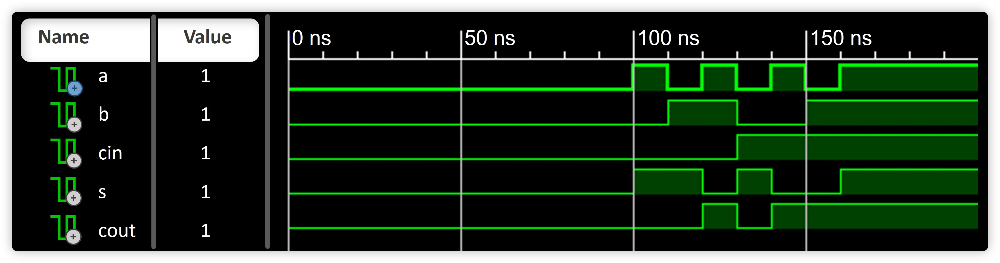

# Digital Logic - Academic Simulations

A collection of **VHDL** and **Verilog** circuits designed for educational purposes. These modular designs serve as learning tools for digital logic design, providing robust starting points for advanced projects. While not production-ready, they are fully modifiable to suit your needs.



> **Note:** These circuits are intended for academic simulations and may require modifications for integration into production environments.

## Table of Contents

- [Overview](#overview)
- [Directory Structure](#directory-structure)
- [Requirements](#requirements)
- [Usage](#usage)
- [Contributing](#contributing)
- [License](#license)

## Overview

This repository offers a range of digital logic circuits implemented in **VHDL** and **Verilog**. Each design is well-commented and structured to facilitate learning and experimentation with core digital concepts. Accompanying testbenches and simulation scripts are provided to help you validate and explore the designs.

## Directory Structure

- **VHDL_Circuits/**: VHDL-based circuit designs with detailed documentation and testbenches.
- **Verilog_Circuits/**: Verilog-based circuit designs with comprehensive comments and testbenches.
- **simulation.jpg**: An image illustrating simulation output or circuit overviews.

## Requirements

- **VHDL Simulator:**
  - **Recommended:** [ModelSim](https://eda.sw.siemens.com/en-US/ic/modelsim/)
  - **Alternative:** [GHDL](https://ghdl.github.io/)

- **Verilog Simulator:**
  - **Recommended:** [Icarus Verilog](https://steveicarus.github.io/)
  - **Alternative:** [Verilator](https://www.veripool.org/verilator/) (for advanced users comfortable with C++)

- **Waveform Viewer:**
  - [GTKWave](http://gtkwave.sourceforge.net/)

## Usage

1. **Clone the Repository:**

    ```bash
    git clone https://github.com/sabneet95/Digital-Logic.git
    ```

2. **Open the Project:**

    Use an IDE like [Visual Studio Code](https://code.visualstudio.com/) with VHDL/Verilog extensions.

3. **Explore the Designs:**

    Navigate to **VHDL_Circuits/** or **Verilog_Circuits/** and review the header comments for design details.

4. **Run Simulations:**

    - **For VHDL Circuits Using GHDL:**

        ```bash
        # Compile the design and testbench
        ghdl -a VHDL_Circuits/your_design.vhd
        ghdl -a VHDL_Circuits/your_testbench.vhd

        # Elaborate the testbench
        ghdl -e your_testbench

        # Run the simulation and generate waveform data
        ghdl -r your_testbench --vcd=your_testbench.vcd
        ```

        *View the waveform using GTKWave:*

        ```bash
        gtkwave your_testbench.vcd
        ```

    - **For Verilog Circuits Using Icarus Verilog:**

        ```bash
        # Compile the design and testbench
        iverilog -o simulation_output Verilog_Circuits/your_design.v Verilog_Circuits/your_testbench.v

        # Run the simulation
        vvp simulation_output
        ```

        *Ensure your testbench includes code to generate waveform data:*

        ```verilog
        initial begin
          $dumpfile("your_testbench.vcd");
          $dumpvars(0, your_testbench);
          // Rest of your testbench code...
        end
        ```

        *View the waveform using GTKWave:*

        ```bash
        gtkwave your_testbench.vcd
        ```

    - **For Verilog Circuits Using Verilator (Advanced Users):**

        ```bash
        # Compile the Verilog code into C++ (Requires a C++ testbench)
        verilator -Wall --cc Verilog_Circuits/your_design.v --exe sim_main.cpp

        # Build the simulation executable
        make -j -C obj_dir -f Vyour_design.mk Vyour_design

        # Run the simulation
        ./obj_dir/Vyour_design
        ```

        *Note:* Replace `your_design.v` with your Verilog module file and provide a corresponding `sim_main.cpp` C++ testbench. Verilator is best suited for users comfortable with C++ and looking for high-performance simulations.

---

## Contributing

Contributions are welcome! To contribute:

1. **Discuss Your Ideas:**

    Open an issue for major changes or new circuits.

2. **Follow Coding Standards:**

    - Include detailed header comments.
    - Use consistent naming and formatting.
    - Update or add testbenches to validate your changes.

3. **Submit Pull Requests:**

    Ensure your changes are well-documented and tests pass before submitting.

## License

This project is licensed under the [MIT License](LICENSE).
